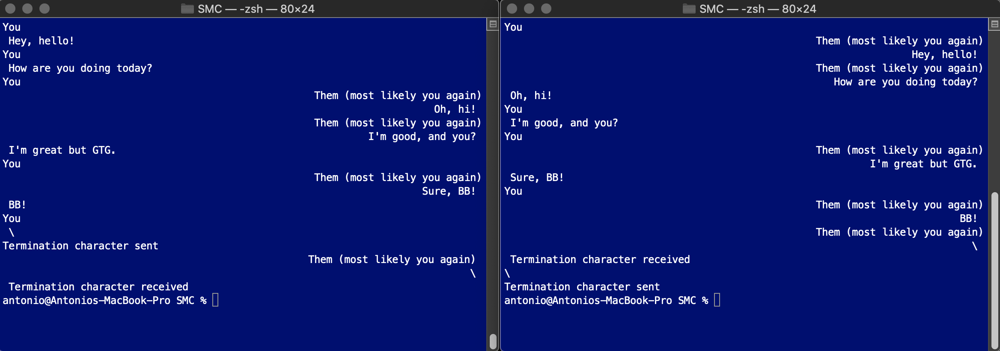

# SMC - Shared memory communication

*SMC* implements a messaging system between two instances of the same applications.

*SMC* depends on *HEG* **([Huffman's Encoding Generator](https://github.com/antonioastorino/HEG))** and is part of **IPC**.

## How to build and run

```
git clone https://github.com/antonioastorino/HEG.git   # clone HEG
git clone https://github.com/antonioastorino/IPC.git   # clone IPC
cd IPC/SMC                                             # cd to the SMC project folder
bin/makeMakefile.sh                                    # generate Makefile                        
make [OPT=<OPT_LEVEL>]                                 # build with desired optimization level
```
`<OPT_LEVEL> = 0, 1, 2, or 3` is the compiler optimization level. If not specified, it will be set equal to `0` by default.

Now you can use the current terminal window for one user. You then need to open another terminal window for the second user. From both windows, run

```
./chat-out-<OPT_LEVEL>
```
Enjoy chatting with yourself!

Once you are done, terminate the communication by sending **from both windows** the character `\`. This will terminate the communication and free the shared memory used to implement it - see screenshot.



## How it works
### General description
The communication between the two users occurs through shared buffers. The buffers are identified by their respective `shmid`, say **A** and **B**.

The first instance of the app creates both buffers and attaches itself to them. It uses buffer **A** for transmitting (writing) messages and buffer **B** for receiving (reading) messages. The two respective `shmid`'s are saved in a file called `shm-id`.

The second instance of the app reads from `shm-id` the saved ID's and attaches itself to them. Then, it transmits messages by writing on **B** and receives messages by reading from **A**, namely the opposite of what the first instance does.

The `smd-id` file is erased when either app instance terminates.

Each app instance has two independent child threads:

- **transmitter**, which writes on one buffer
- **receiver**, which reads from the other buffer

### Shared circular buffer
The shared buffers have same, fixed length, whose value is stored in the `SMC::bufferSize` constant, defined in `SMCCommon.hpp`. The buffers are used as a *circular buffer*, as described below.

Due to the perfect symmetry of the communication system, in the following, it is not specified which app instance is considered and the description is given as seen from one buffer's standpoint, no matter if **A** or **B** - at this stage, they are logically indistinguishable.

Let `w` and `r` be the indices at which the transmitter and receiver, respectively, are currently accessing the buffer. The values of `w` and `r` are stored in the last two buffer elements. This entails that, if the buffer is a vector of N-bit elements, the buffer cannot be larger than `2^N + 2` elements, otherwise it would be impossible for the `w` and `r` to store the addresses of any element location. In addition, the buffer has to have at least 4 elements.

> More precisely, it is necessary to have 2 elements plus enough memory to contain the encoded *termination character* (`\`) and the encoded *new line* character (`\n`). If this condition is not satisfied, it will not be possible to gracefully end the communication.

#### Initial condition

Initially, `w = r = 0` and the transmitter is waiting for inputs from the terminal. The buffer contains invalid (`I`) data, except for that at locations `buffer size - 2` and `buffer size - 1`, respectively being the read index location (`RIL`), the write index location (`WIL`).

```
                Initial condition

w = 0                                    RIL
  |                                       |
 ------------------------       ---------------- 
| I | I | I | I | I | I |  ...  | I | I | 0 | 0 |
 ------------------------       ----------------     
  |                                           |
r = 0                                        WIL
```


#### Full-buffer condition
When a new message is ready to be sent, the transmitter

1. writes to the buffer at location `w`
2. checks if `w = r - 1`
3. if not, increments `w`

The condition `w = r - 1` is achieved when the transmitter writes faster than the receiver reads. This means that the transmitted has made a full circle around the buffer and "hit" the receiver from behind. In other words, the buffer is *full,* meaning that all the data is valid (`V`) and waiting for being read.

```
                 Full-buffer condition

              w = r - 1                  RIL
                  |                       |
 ------------------------       ----------------
| V | V | V | V | V | V |  ...  | V | V | 4 | 3 |
 ------------------------       ----------------    
                      |                       |
                    r = 4                    WIL
```

#### Empty-buffer condition
The receiver acts as follows:

1. checks if `r = w`
2. if not
    - reads from the buffer and
    - increments `r`

The condition `r = w` means that the receiver has read all the data sent by the transmitter and must wait for new data to be written. The buffer contains only invalid (`I`) data and therefore it is considered as *empty*.

```
               Empty-buffer condition

                w = 4                    RIL
                  |                       |
 ------------------------       ----------------
| I | I | I | I | I | I |  ...  | I | I | 4 | 3 |
 ------------------------       ----------------    
                  |                           |
                r = w                        WIL
```
#### Steady state
At steady state, the buffer is partly full and the writer is "ahead" with respect to the reader. Since the buffer is circular, this **cannot** be expressed by the relation `w > r` but simply by the fact that the two conditions above are not met.

```
                    Steady state

    w = 1                                RIL
      |                                   |
 ------------------------       ----------------
| V | V | I | I | V | V |  ...  | V | V | 4 | 1 |
 ------------------------       ----------------    
                  |                           |
                r = 4                        WIL
```
## Final remarks
This project is not intended for professional use. It is designed for learning purposes and for fun. Nevertheless, I would appreciate constructive feedback which I would surely consider for improving the project itself and learning more about the topic and programming.

Please, contact me if you have questions or comments.